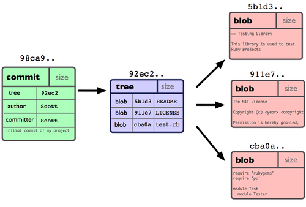

Branch
======

### Branch란 무엇인가

-	코드를 통째로 복사하여 독립적인 개발을 하고자 할 때 Branch를 이용한다.

-	Git은 매우 가벼운 Branch를 지원하고 있기 때문에 대부분의 작업을 브랜치를 새로 만들어 작업하고 나중에 머지하는 방법을 권장한다.

-	commit의 구조

	-	blob : 파일이 stage됬을 때 Git 저장소에 저장된 파일
	-	tree : 파일과 디렉토리구조가 들어있는 데이터
	-	commit : 메타데이터와 트리를 가리키는 포인터를 담은 커밋 개체

-	commit 개체 하나하나가 스냅샷으로 저장된다.

-	브랜치는 커밋사이를 가볍게 이동할 수 있는 포인터를 의미한다.

-	Git은 기본적인 브랜치로 master를 생성한다. master는 기본적으로 가장 마지막 커밋을 가리킨다.

-	HEAD포인터는 현재 작업하는 로컬 브랜치를 가리킨다.

-	checkout 명령어를 사용하여 HEAD포인터를 다른 브랜치로 이동시킬 수 있다.  
	이 상태에서 커밋을 하게 되면 새로운 브랜치는 새로운 커밋을 가리키고 HEAD포인터도 계속 새로운 브랜치를 가리킨다. 하지만 master브랜치는 여전히 이전의 커밋을 가리키고 있게 된다.  
	이 상태에서 master브랜치로 체크아웃하면 Working Directory의 파일은 master 브랜치가 가리키는 커밋의 시점으로 돌아가게 된다.  
	따라서 새로만든 브랜치는 master에서 뻗어나와 독립적인 작업을 하는 브랜치가 된다.  
	master브랜치에서 원래 하던 작업을 이어 새로운 커밋을 하면 다음과 같은 상태가 된다.

### Branch Merge

-	Fast-forward Merge는 머지할 브랜치가 가리키는 커밋이 현재의 브랜치가 가리키는 커밋보다 앞으로 진행된 상태일 때 사용된다.  
	보통 긴급하게 오류가 발생했을 때 hotfix브랜치를 만들어 미리 오류 수정 및 테스트를 거치고 메인브랜치를 땡겨올 때 사용한다.

-	3-way Merge는 각 브랜치가 가리키는 두개의 커밋과 공통의 조상 커밋 하나를 사용하여 머지하는 방법이다.  
	보통 독립적인 브랜치와 기존의 사용하는 브랜치를 병합할 때 사용한다.  
	이 때 공통의 조상이 되는 커밋을 Git이 자동으로 찾아 준다.  
	3-way merge를 실행하면 부모커밋이 2개인 새로운 커밋이 생성되고 메인브랜치는 이 커밋을 가리키게 된다.

**before**

**after**

-	**3-way Merge가 충돌 때문에 실패하는 경우가 있다.  
	이런 경우는 각각의 브랜치가 공통되는 부분을 서로 다르게 수정했을 경우 발생한다.  
	이런 경우는 Git이 자동으로 머지하지 못하기 때문에 Git이 알려주는 부분을 직접 확인한 후 변경내용을 수정하고 머지를 실행해야 한다.**

-	**브랜치를 만들고 사용한 후에는 사용하지 않는 브랜치를 삭제하는 방법으로 정리해주는 것이 좋다.**

### Branch Workflow

-	개발자들이 선호하는 workflow는 Long-Running 브랜치

-	배포 코드는 master브랜치에 머지하여 항상 안정된 버전의 코드만 master 브랜치에 둔다.

-	개발을 진행하거나 안정화 할 때는 develop이나 next라는 이름의 브랜치를 사용

-	develop이나 next브랜치는 안정화 될 때까지 테스트를 거친 후 배로할 때 master 브랜치에 머지시킨다.

-	topic 브랜치는 develop브랜치보다 앞서 개발되는 내용을 담는다.  
	hotfix브랜치도 topic브랜치의 한 종류로 볼 수 있다.

### Remote Branch

-	리모트 브랜치는 리모트 저장소에 있는 브랜치를 의미한다.

-	리모트 브랜치의 이름은 (remote)/(branch) 형식으로 되어 있다.  
	리모트 브랜치는 대부분 origin을 사용하여 접속하므로 origin/(branch)로 되어 있다.

-	로컬과 서버의 커밋 히스토리는 독립적으로 이루어진다.

-	위 그림은 로컬에 리모트서버의 브랜치들을 페치한 결과이다. 로컬에서 작업하던 내용은 새로운 라인으로 독립되어 나왔고 리모트서버에 새로 추가된 작업은 덧붙여져서 표시된다.

-	로컬저장소의 브랜치는 자동으로 리모트 저장소에 추가되지 않는다. 명시적으로 브랜치를 push해야 가능하다.  
	따라서 로컬에서만 사용하는 비공개 브랜치를 만들 수 있다.

-	리모트 브랜치도 사용 후에는 삭제하여 정리하는 것이 좋다.
