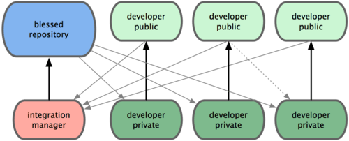

Workflow의 종류
===============

### 분산 환경에서의 Workflow

-	Git의 구조가 유연하기 때문에 여러 개발자가 함께 작업하는 방식을 더 다양하게 구성할 수 있다.

-	Git에서는 각 개발자의 저장소가 하나의 노드이기도 하고 중앙 저장소 같은 역할을 한다.

### Centralized Workflow

-	모든 개발자가 중앙 저장소를 중심으로 작업한다.

-	다른 개발자가 중앙 저장소에 Push를 한 경우 그 이후에 작업을 하는 개발자가 Push를 할 때 이미 변경된 내용을 덮어쓰지 않도록 시스템이 제어한다.

-	위와 같은 경우 merge혹은 fetch를 수행한 후 push가 가능하다고 시스템이 사용자에게 알려준다.

-	개발자에게 가장 익숙한 형태로 거부감이 없다.

### Integration-Manager Workflow

-	프로젝트 매니저가 존재하는 경우에 사용가능하다.

-	여러개의 원격저장소를 활용한다.

-	개발자들은 메인저장소에서 쓰기 권한을 제외당하고 읽기 권한만 갖는다. 따라서 최종저장소에서 가져온 데이터를 바탕으로 개발한다.

-	매니저는 메인저장소에 모든 권한을 갖는다.

-	각 개발자들은 자신만의 저장소를 만들고 매니저가 접근가능하도록 설정한다. 자신이 만든 내용은 자신만의 저장소에 push한다.

-	매니저는 다른 개발자들의 저장소에서 데이터를 가져온 후 그것을 머지하고 테스트한 후 메인 저장소에 push한다.

### Dictator Lieutenants Workflow

-	여러개의 저장소를 운영하는 방식을 변형한 방식이다.

-	중간관리자를 두는 방식이다.

-	중간 관리자는 관련된 작업을 하는 모든 개발자들의 데이터를 받는다.

-	중간 관리자들이 머지하고 push한 데이터를 최종 관리자가 다시 merge하여 메인저장소에 push한다.

