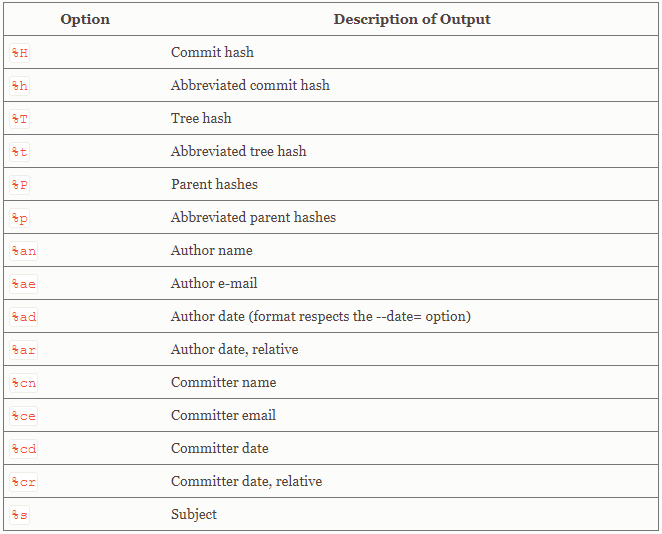

Git 사용법
==========

### Git 저장소 만들기

1.	기존 프로젝트 저장소를 Git 저장소로 만든다.(git add명령어 사용)

2.	서버에 미리 저장소를 만들고 로컬에 Clone하여 사용 가능

### 파일 관리 상태

-	Untracked : 현재 Git이 관리 하지 않는 대상, Tracked파일이 아니 모든 것

-	Tracked : 현재 Git이 관리 하는 대상(파일), 이미 스냅샷에 포함되어 있는 파일, 저장소를 Clone하면 모든 파일은 Unmodified상태

	-	Unmodified : Untracked상태에서 수정을 하기 위해 관리 대상에 포함되었지만 아직 아무것도 수정되지 않은 상태
	-	Modified : Unmodified상태에서 사용자가 수정한 상태
	-	Staged : 커밋하기 직전의 상태

### 파일 무시하기

-	로그 파일이나 빌드 시스템이 자동으로 생성한 파일은 Git에 추가하거나 Untracked파일임을 보여줄 이유가 없다.

-	.gitignore파일을 만들고 그 안에 무시할 파일의 패턴을 만들어서 관리

### 변경 사항 저장하기

-	수정한 것을 커밋하려면 Staging Area에 파일을 정리해야 한다.(Unstaged 상태의 파일은 커밋되지 않는다.)

-	commit 명령어를 사용하여 변경 사항을 저장한다.

### Commit History 조회

-	다양한 명령어 옵션을 통해서 commit history을 확인 할 수 있다.

-	GUI도구를 사용하면 시각화된 commit history 를 조회 할 수 있다.

[GUI 도구 : Source Tree](https://www.sourcetreeapp.com/)

### Commit 수정

-	커밋을 다시 하고 싶을 때 amend 옵션을 사용한다.

-	커밋 메시지를 수정하는 것도 가능하다.

-	파일 상태를 Staging Area에서 Unstaged 상태로 변경하는 것도 가능하다.

-	Modified 파일을 되돌리는 것도 가능하지만 이 기능을 사용할 때는 수정된 내용이 모두 사라진다는 것을 고려해야 한다.

### 리모트 저장소

-	인터넷 혹은 네트워크에 있는 저장소를 의미한다

-	권한을 관리하여 읽기, 쓰기, 수정을 관리한다.

-	리모트 저장소가 등록되면 SSH URL인 origin이 자동으로 등록된다. 따라서 origin을 이용해야 저장소에 Push가 가능하다.

-	Fetch 명령어는 저장소를 로컬으로 Clone한 이후에 생성되거나 수정된 파일을 모두 로컬로 가져온다. 하지만 자동으로 Merge(병합)하지 않으므로 수동으로 병합수행을 해야한다.

-	Pull 명령어는 리모트 저장소 브랜치에서 데이터를 가져올 뿐 아니라 자동으로 로컬브랜치와 병합시킬 수 있다.

-	Push 명령어는 리모트 저장소에 쓰기 권한이 있는 상태에서 자신이 작업한 내용을 리모트 저장소에 저장하기 위한 명령어이다.  
	자신이 Clone한 이후에 누군가가 Push를 미리 했다면 그 사람의 작업내용을 미리 가져와서 머지한 후에 내가 작업한 내용을 Push할 수 있다.

### Tag

-	Tag 명령어를 사용하여 버전이름과 같은 내용을 추가할 수 있다. 또한 개인키를 이용하여 태그에 자신의 Signature를 포함 시킬 수 있다.

### Bash shell

-	Git BASH 쉘을 이용하면 CLI환경에서의 다양한 명령어를 조금 더 쉽게 사용할 수 있다.

[Git(Git BASH) 다운](https://gitforwindows.org/)
